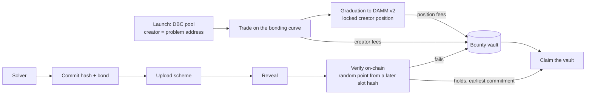

# meteortoll

**Open problems you can trade.** Each token on meteortoll is an open matrix multiplication problem
— "multiply an n×m by an m×p matrix with at most R multiplications" — launched on
[Meteora's Dynamic Bonding Curve](https://docs.meteora.ag/developer-guides/dbc). Every trade pays a
fee into the problem's bounty. Whoever submits a scheme that a Solana program verifies on-chain
takes the bounty, and keeps receiving the token's fees after that. No committee, no oracle.

- Live app (devnet): **https://meteortoll.vercel.app**
- Full devnet lifecycle with explorer links: [`docs/devnet-run.md`](docs/devnet-run.md)
- Built for Meteora's *Best use of DBC* track (Crypto World's Fair)

## How it works



- **Launch.** A problem is a DBC pool on our launchpad config. The pool's creator is the
  problem's own address, derived from the pool and the statement, so the statement is fixed by the
  pool itself and cannot be swapped.
- **Trade.** Every non-protocol trading fee goes to the creator, which is the bounty vault. After
  graduation, DBC hands the creator's permanently locked DAMM v2 position to the same address, and
  its fees keep feeding the bounty.
- **Solve.** A solver commits a hash of their scheme with a bond, uploads it, and reveals. The test
  point comes from a slot hash newer than the commitment.
- **Verify.** The program checks Σᵣ (uᵣ·A)(vᵣ·B)(wᵣ·G) = Σ A·B·G at that random point, in the field
  of integers modulo the Mersenne prime 2⁶¹−1 (`P` in `src/field.rs`). Three field elements from the
  seed give every entry a power as its value, so distinct terms of the identity stay distinct;
  coefficients are bounded integers, so every exact coefficient is below `P`. By Schwartz–Zippel a
  wrong scheme passes with probability at most (n₁n₂ + n₂n₃ + n₃n₁)/2⁶¹, which is 175/2⁶¹ for
  the shape (7, 7, 9); `tests/facts.rs` asserts these. The check is resumable across transactions, and a product
  too heavy for one transaction is refused. A failing scheme forfeits its bond to the bounty.
- **Claim.** The earliest commitment that holds wins: anyone copying an upload necessarily commits
  later. After a grace window the solver claims the vault, and can claim again as fees arrive.

## Meteora integration

Launch, trading, all three fee sources and graduation run through Meteora's DBC and DAMM v2, tested
against their mainnet binaries and run end to end on devnet. Every path, instruction and call:
[`docs/meteora.md`](docs/meteora.md).

## Repository

| Path | What |
|---|---|
| `src/`, `tests/` | Verifier core: `no_std`, zero dependencies; mutation-tested |
| `programs/toll/` | The Anchor program and its tests (flow, Meteora integration, compute cost, unit); mutation-tested with `cargo-mutants` |
| `crates/verifier-wasm/` | The verifier as WebAssembly for the browser |
| `packages/core/` | Addresses, IDL, scheme encoding and commitments shared by app and CLI |
| `app/` | The web app (Next.js) |
| `client/` | CLI: setup, launch, buy, sweep, solve, claim |
| `problems/` | Known formats and records, curated problem notes |
| `docs/` | Meteora integration, devnet run, mainnet runbook, security notes, plans |

## Build and test

```bash
cargo test                                   # verifier core
scripts/build.sh test                        # program + LiteSVM tests (in the WSL toolchain)
scripts/mutants.sh                           # mutation testing of the program (cargo-mutants, WSL)
scripts/build-wasm.sh                        # browser verifier → app/public/verifier.wasm
npm install && npm test -w app               # app unit tests
npm run e2e -w app                           # browser tests (a production build; needs a devnet RPC in SOLANA_RPC_URL)
npm run build -w app                         # web app
npm run toll -w client -- status             # CLI against devnet
```

The program tests load mainnet program dumps from `programs/toll/tests/fixtures/`
(`solana program dump -u mainnet-beta <program> <file>.so`).

## Security

See [`docs/security.md`](docs/security.md) for the web app and `SCOPE.md` for the program's rules.
The program has had a self-review and extensive tests against the real Meteora programs; it has
**not** had a third-party audit. During the hackathon the upgrade authority is held by the team.

## Prior work and third-party code

Disclosed as the hackathon rules ask:

- **This repository** was started on 2026-10-01, during the Crypto World's Fair.
- **`fmm` (the team's own, earlier; private repository)** — a search tool for fast matrix
  multiplication schemes. It is used only off-chain, to find schemes and to build
  `problems/known.json`. The demo problems are solved with its schemes and are labelled as
  disclosed demos; the app discloses whenever the team's tool already meets a problem's target.
- **`simdr`, `grit`, `experiment001`** (the team's own, earlier) — not used in this product.
- **Meteora** DBC and DAMM v2 programs, IDLs and the `@meteora-ag/dynamic-bonding-curve-sdk`;
  **Anchor**; **Solana web3.js** and wallet adapter; **Next.js**; LiteSVM for tests.
- Best-known ranks come from Sedoglavic's
  [catalogue of fast matrix multiplication algorithms](https://fmm.univ-lille.fr/), via `fmm`'s
  dated snapshot.

## License

MIT OR Apache-2.0, as declared in the crates' `Cargo.toml`.
